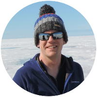

**I am a glaciologist working on the mass balance of the Greenland Ice Sheet.** I use a combination of field measurements, remotely-sensed data and computer models to explore the vulnerability of the Greenland Ice Sheet to projected climate change. I have particular interests in the manipulation and analysis of large, multi-dimensional datasets.

Currently I am based in the [Department of Geosciences](https://www3.unifr.ch/geo/en/) at Université de Fribourg, Switzerland. I also work with the [Bristol Glaciology Centre](http://www.bris.ac.uk/geography/research/bgc/) at the [University of Bristol](http://www.bris.ac.uk/).

I have developed **GeoRaster**, a Python package for working with geographic rasters. Take a look at the [blog post](blog/georaster-released), [documentation](http://georaster.readthedocs.io/en/latest/) or [GitHub repository](https://github.com/atedstone/georaster) for more details.

## Contact me
Please feel free to get in touch: 

*Email:* `andrew.tedstone at unifr.ch` or `a.j.tedstone at bristol.ac.uk`.

*Phone (office):* +44 (0) 117 42 82367.

## Background

* August 2019-: Senior Researcher, Université de Fribourg, Switzerland
* January 2016-: Research Associate, University of Bristol, UK
* 2011-2015: *Ph.D* 'Hydrological controls on Greenland Ice Sheet motion', University of Edinburgh, UK
* 2010-2011: *M.Phil* 'Sediment plumes as indicators of Greenland Ice Sheet hydrology', University of Cambridge, UK
* 2007-2010: *MA* Geography, University of Cambridge, UK

For more information you may download my [CV](images/cv-2019-07-24-tedstone.pdf) *(last updated 24 July 2019)*.
